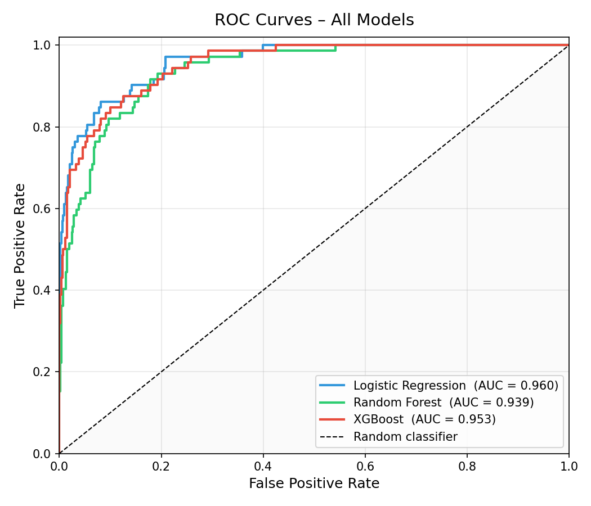
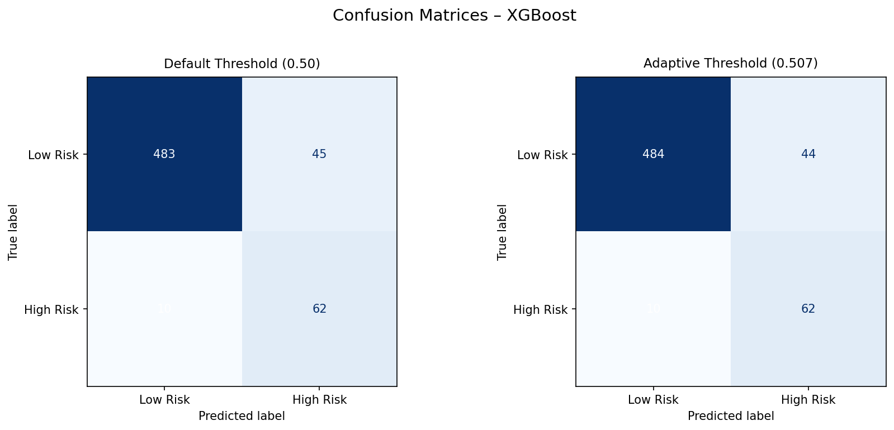
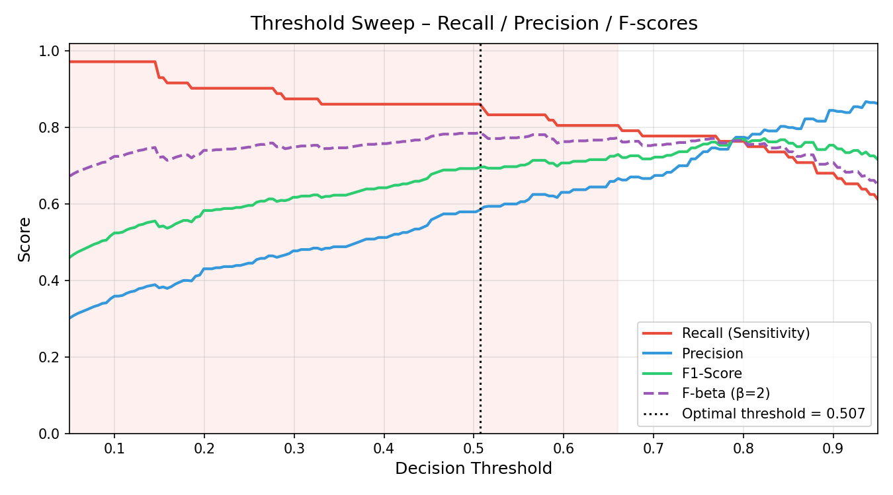
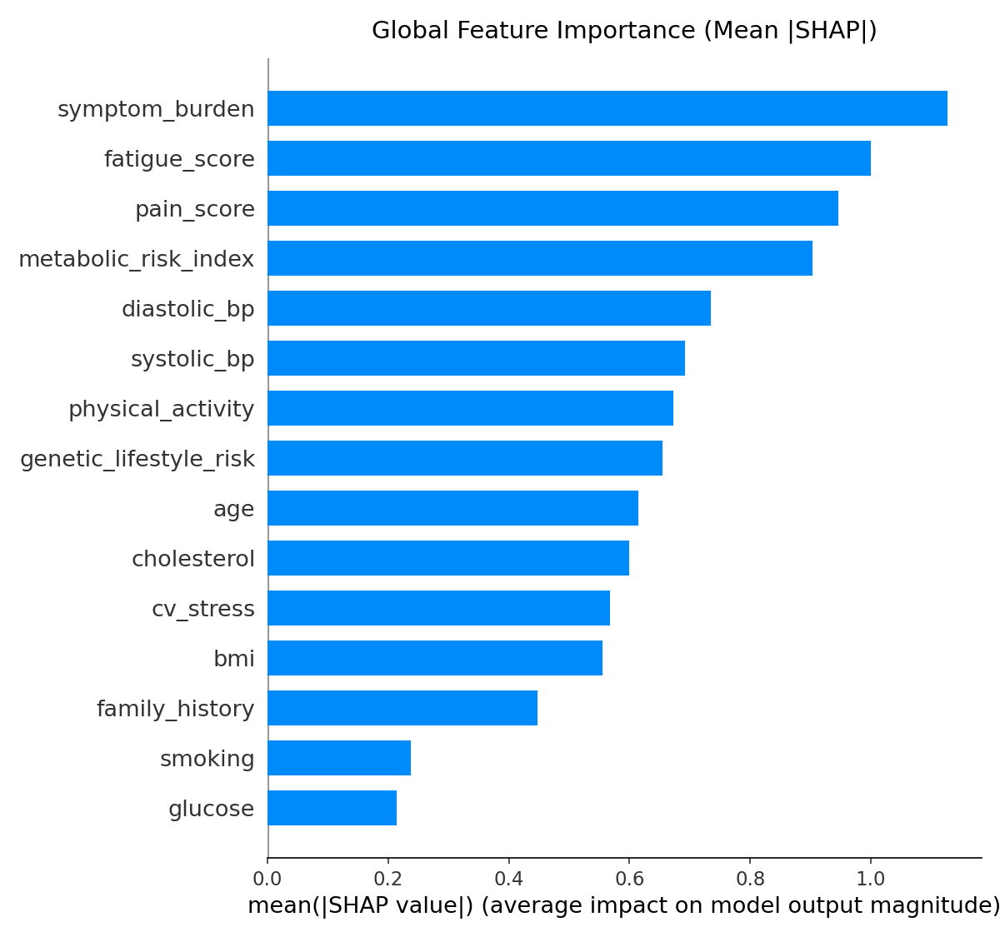
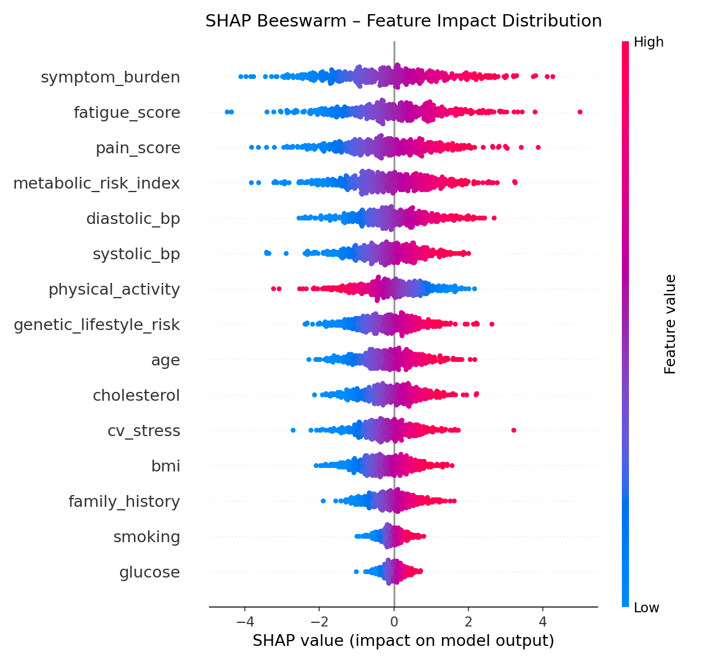
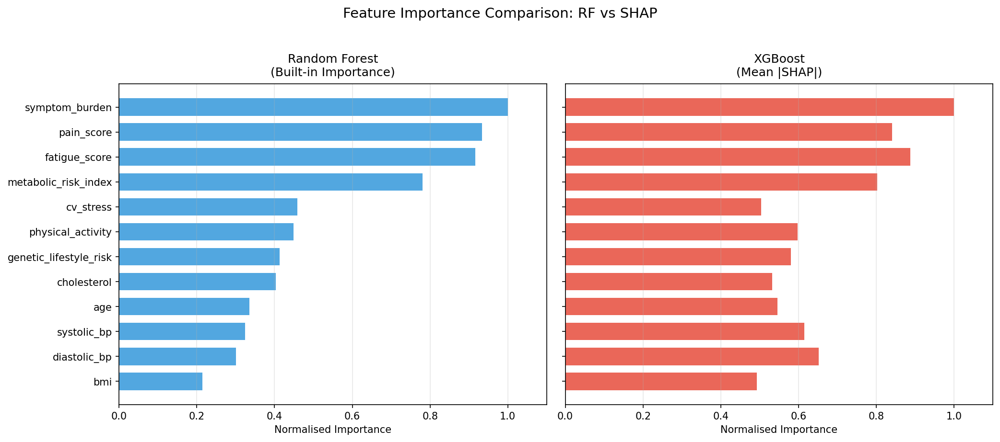
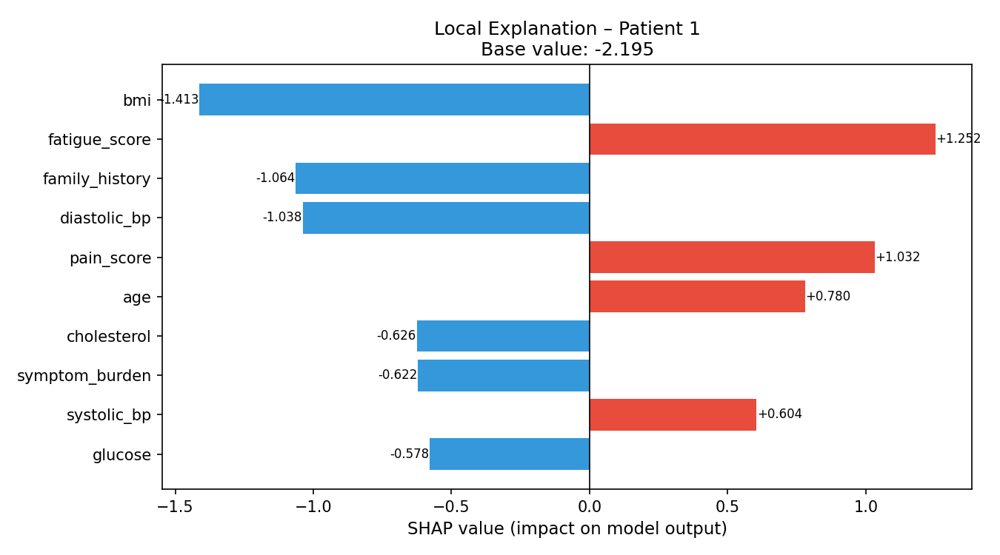

# Causal-Aware ML Framework
## Counterfactual Explainability and Adaptive Thresholding for Rare Disease Risk Prediction

This project is a complete machine learning pipeline for rare disease risk prediction with a focus on clinical usefulness, not just raw classification accuracy. It combines data preprocessing, model training, adaptive thresholding, SHAP explainability, counterfactual recommendations, causal inference, and a Streamlit dashboard.

## What This Project Does

- Ingests a Kaggle-style medical dataset and standardizes common clinical column names.
- Engineers clinically motivated composite features such as metabolic and cardiovascular risk indices.
- Trains Logistic Regression, Random Forest, and XGBoost models.
- Chooses an operating threshold that prioritizes recall to reduce missed diagnoses.
- Explains predictions globally and locally using SHAP.
- Generates actionable counterfactual suggestions for modifiable risk factors.
- Runs causal analysis to separate correlation from approximate causal effect.
- Produces reusable reports, plots, and patient-level prediction summaries.

## Why The Project Matters

Rare disease screening often fails when models optimize for accuracy alone. In this workflow, the decision threshold and evaluation strategy are tuned to reduce false negatives, which is more relevant for early clinical triage. The additional explainability and counterfactual layers make the model easier to interpret for both technical and non-technical users.

## Performance Snapshot

The current run produced the following model results:

| Model | Accuracy | Precision | Recall | F1 | ROC AUC |
|------|----------:|----------:|-------:|---:|--------:|
| Logistic Regression | 0.9083 | 0.5794 | 0.8611 | 0.6927 | 0.9597 |
| Random Forest | 0.9133 | 0.6429 | 0.6250 | 0.6338 | 0.9392 |
| XGBoost | 0.9317 | 0.7183 | 0.7083 | 0.7133 | 0.9529 |

The adaptive threshold optimizer selected:

- Strategy: F-beta
- Beta: 2.0
- Optimal threshold: 0.5068
- Recall: 0.8611
- False negatives: 10

## Visualizations

These plots are already generated in the repository and will render directly on GitHub:

### ROC Curves



### Confusion Matrices



### Threshold Sweep



### Global SHAP Importance



### SHAP Beeswarm



### Feature Importance Comparison



### Local SHAP Example



## Project Structure

```text
rare_disease_ml/
├── main.py                  # Entry point for the full pipeline
├── data_generator.py        # Data loading, normalization, preprocessing
├── model_training.py        # Model fitting and evaluation
├── threshold_optimizer.py   # Adaptive threshold selection
├── explainability.py        # SHAP-based explanations
├── counterfactuals.py       # Counterfactual generation
├── causal_analysis.py       # Causal inference and correlation comparison
├── visualizations.py        # ROC, SHAP, threshold, and comparison plots
├── predictor.py             # Patient-level inference helper
├── app.py                   # Streamlit dashboard
├── requirements.txt
├── data/
└── outputs/
```

## Pipeline Overview

### 1. Data Loading and Normalization

- Loads `data/kaggle_data.csv` by default.
- Maps common alternate column names into the project schema.
- Normalizes the target column to `disease_risk` with binary values.
- Uses SMOTE oversampling on the training split to reduce class imbalance.

### 2. Feature Engineering

| Engineered Feature | Formula |
|-------------------|---------|
| `metabolic_risk_index` | `(cholesterol/200 + glucose/100 + bmi/25) / 3` |
| `cv_stress` | `(systolic_bp/120 + diastolic_bp/80) / 2` |
| `symptom_burden` | `fatigue + pain` |
| `genetic_lifestyle_risk` | `familyHistory*2 + smoking + (3 - activity)` |

### 3. Model Training

| Model | Imbalance Handling |
|-------|--------------------|
| Logistic Regression | `class_weight="balanced"` |
| Random Forest | `class_weight="balanced"` |
| XGBoost | `scale_pos_weight=neg/pos` |

### 4. Threshold Optimization

- Sweeps 200 thresholds from 0.05 to 0.95.
- Default strategy uses F-beta with beta = 2.
- Alternative strategies include recall maximization and Youden's J statistic.
- The goal is to reduce missed positive cases.

### 5. Explainability

- Uses `shap.TreeExplainer` with interventional perturbation.
- Produces global importance plots and patient-level waterfall explanations.

### 6. Counterfactuals

- Uses DiCE when available.
- Falls back to a custom greedy counterfactual search when needed.
- Focuses on modifiable factors to keep suggestions clinically actionable.

### 7. Causal Analysis

- Uses DoWhy when available.
- Falls back to regression-based approximate average treatment effect estimates.
- Compares causal estimates with Pearson correlation.

## Generated Outputs

| File | Description |
|------|-------------|
| `outputs/trained_models.pkl` | Saved model dictionary |
| `outputs/trained_preprocessor.pkl` | Saved preprocessing pipeline |
| `outputs/evaluation_summary.csv` | Accuracy, precision, recall, F1, ROC AUC |
| `outputs/threshold_sweep.csv` | Per-threshold metrics |
| `outputs/threshold_report.txt` | Selected threshold and confusion matrix summary |
| `outputs/shap_values.csv` | SHAP values matrix |
| `outputs/shap_summary_bar.png` | Global SHAP feature ranking |
| `outputs/shap_summary_beeswarm.png` | SHAP distribution plot |
| `outputs/shap_local_patient{N}.png` | Local patient explanation plots |
| `outputs/roc_curves.png` | ROC curves for all models |
| `outputs/confusion_matrices.png` | Default vs adaptive threshold comparison |
| `outputs/threshold_sweep.png` | Precision and recall across thresholds |
| `outputs/feature_importance_comparison.png` | RF importance vs SHAP comparison |
| `outputs/counterfactual_report.txt` | Counterfactual recommendations |
| `outputs/causal_report.txt` | Causal analysis report |
| `outputs/causal_vs_correlation.csv` | Correlation vs causal effect table |
| `outputs/patient_prediction_report.txt` | Individual prediction summary |

## Quick Start

### Install dependencies

```bash
pip install -r requirements.txt
```

### Add the dataset

Place the Kaggle CSV at:

```text
data/kaggle_data.csv
```

Supported binary target column names include `disease_risk`, `target`, `label`, `outcome`, `class`, `diagnosis`, and `has_disease`.

### Run the full pipeline

```bash
python main.py
```

This will train the models, evaluate them, tune the operating threshold, generate SHAP explanations, create counterfactuals, run causal analysis, and save all outputs.

### Launch the dashboard

```bash
streamlit run app.py
```

## Sample Patient Report

```text
PATIENT RISK REPORT
------------------------------------------------------------
Decision         : HIGH RISK
Risk Probability : 83.7%
Threshold Used   : 0.328

Top Contributing Factors:
  genetic_lifestyle_risk   SHAP=+0.4821   [increases risk]
  cholesterol              SHAP=+0.3102   [increases risk]
  metabolic_risk_index     SHAP=+0.2887   [increases risk]
  physical_activity        SHAP=-0.1943   [reduces risk]
  smoking                  SHAP=+0.1721   [increases risk]
------------------------------------------------------------
```

## Ethical Notes

- This project is for research and decision-support only.
- It must not replace professional medical diagnosis or treatment.
- Counterfactuals should remain focused on modifiable factors.
- Causal estimates depend on the assumed graph and available confounders.
- All outputs should be reviewed by domain experts before use.

## Libraries Used

`pandas`, `numpy`, `scikit-learn`, `xgboost`, `imbalanced-learn`, `shap`, `dice-ml`, `dowhy`, `matplotlib`, `streamlit`
